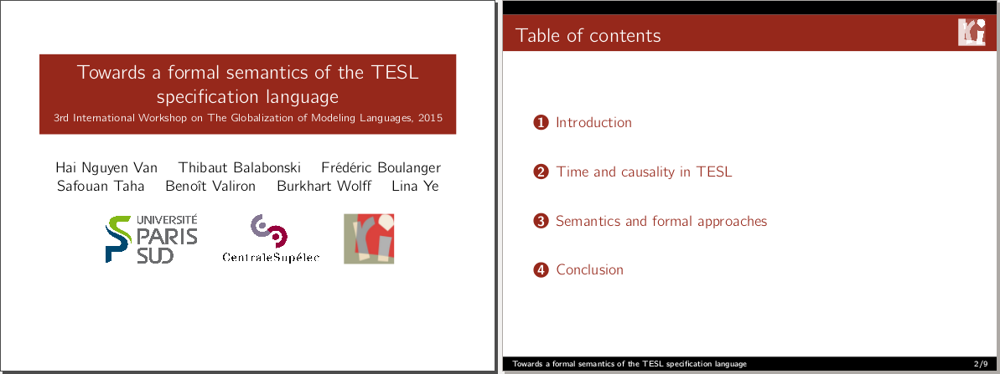

LRI Beamer theme
==========================

> A customized Beamer theme (forked from Frankfurt) for LRI/Université Paris-Sud

Usage
--------------------------
The `beamerthemeLRI.sty` file shall be placed in the same directory of your Beamer presentation or in your `texmf/tex/latex/beamer/themes/theme`.

Disclaimer
--------------------------
THE PROVIDER MAKES NO REPRESENTATIONS ABOUT THE SUITABILITY, USE, OR PERFORMANCE OF THESE TIPS OR ABOUT ANY CONTENT OR INFORMATION MADE ACCESSIBLE BY THESE, FOR ANY PURPOSE.

Hai Nguyen Van <nguyen-van@lri.fr>

